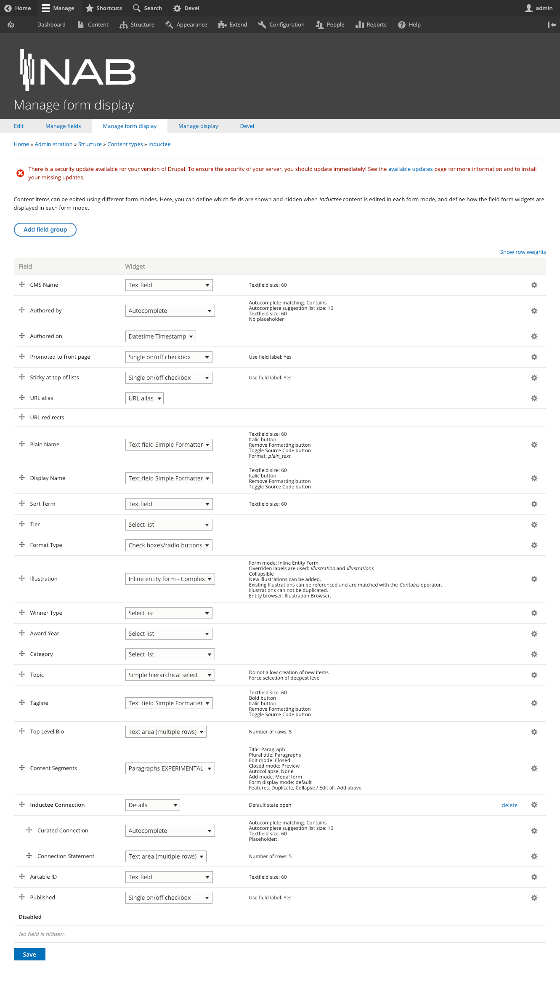
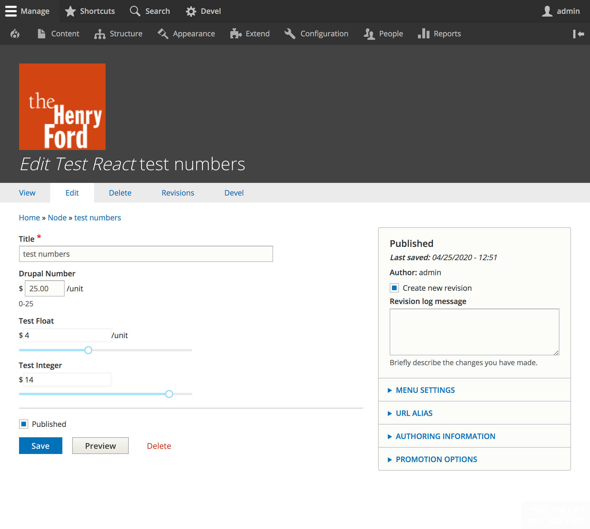

autoscale: true
build-lists: true
slidenumbers: true
footer: Pete Inge | Bluecadet | Injecting React into Your Authoring Experience
theme: Work, 7

# Injecting React into Your Authoring Experience

^ * Be the Story Teller
* Breathe

---

# Who am I?

## Pete Inge
### Tech Lead, Bluecadet

pinge@bluecadet.com
https://github.com/pingevt/drupal-react-widgets

^ Experience: ~10yrs freelance in web dev
Worked in D5-D8
Current: @ BC for 4.5 years
I'm a problem solver
Contact for more info

---

#Bluecadet

^ Established in 2007, Bluecadet is an Emmy Award-winning digital agency that creates world-class websites, mobile apps, interactive installations, and immersive environments. We collaborate with leading museums, cultural institutions, universities, progressive brands, and nonprofit organizations to educate, engage, and entertain.

^ Bluecadet is an experience design agency. We partner with mission-driven organizations to create a broad suite of products and environments. We embrace design, technology, and innovation in the service of content, emotion, and experience. We create experiences that engage audiences through increased knowledge, empathy, and action.

^ We do not consider ourselves a Drupal shop. We do want to use the right tool for the right job. That said, we do use Drupal, and the "other" CMS for most of our BE needs. We are slated this year to really epxplore other CMSs, but my gut is telling our websites will stay inthe Drupal sphere for quite awhile.

---

# Who is this for?

- Moderate to Advanced Coders

---

# Let's get started

^ Why are we dealing with this? What's the issue?

---

# Drupal's Admin Experience

Is...

---

# Drupal's Admin Experience

Is... __NOT__ good

---

# Drupal's Admin Experience

Is... __NOT__ good

   But Why?

^ But we have to ask ourselves why?

---

# Drupal's Admin Experience
## Is __NOT__ good

- Is it because Drupal is inherently bad?
- The underlying archetecture is bad? (Think Forms??)

---
[.build-lists: false]
# Drupal's Admin Experience
## Is __NOT__ good

- ~~Is it because Drupal is inherently bad?~~
- ~~The underlying archetecture is bad? (Think Forms??)~~

# I would argure __NO__.!!

---

# Drupal's Admin Experience
## Is __NOT__ good

A good admin experience has to be _designed_, _opinionated_ and _purposeful_. This is hard to do in a system that tries to be eveything for everyone. __Especially when you get into complex data structures!__

---

# Drupal's Admin Experience
## Is __NOT__ good

A good admin experience has to be _designed_, _opinionated_ and _purposeful_. This is hard to do in a system that tries to be eveything for everyone. __Especially when you get into complex data structures!__

Can it be done? YES!

---

# Drupal's Admin Experience
## Is __NOT__ good

A good admin experience has to be _designed_, _opinionated_ and _purposeful_. This is hard to do in a system that tries to be eveything for everyone. __Especially when you get into complex data structures!__

Can it be done? YES!

Should it be done? YES! [Admin UI & JavaScript Modernisation](https://www.drupal.org/about/strategic-initiatives/admin-ui-js)

^ Overall Drupal is making great strides... However, our projects are now. And as developers we need to push the boundaries.

^ What steps can we take now?? Lets take a deeper look at what we have available in Drupal...

^ Lets first tke a look at a bit of Drupal's archetecture.

---

# Drupal's Underlying Archetecture

- Entities
- Fields
  - (plugin) Field => Defines Data Structure
  - (plugin) Field Widget => Defines Data Entry
  - (plugin) Field Formatter => Defines Data Display

^ We have a few entry points here to effect how Drupal does it's job.

^ For today's talk we are specifically going to look at Field widgets.

---

# Field Widgets

"Field API widgets specify how fields are displayed in edit forms."

^ Hopefully you are all familiar with the image here: The Form Display Page. Different ways to enter data... _Select List_ VS _checkboxes/radios_?

---

# Field Widgets

On the node edit form, Drupal inherently does not care about HOW the data gets in, it just needs the data... using a _widget_.

This opens up a world of possibilities to us.

^ And as developers we can develop the crap out of it!

---

# Field Widgets
## What are we going to look at today

1. Single Field React Widget
1. Complex Data React Widget

^ NOTE: I will not go into depth with the React side of code. I'm not a react expert by any means.. except to show you what we absolutely need for Drupal to work.

^ NOTE: we are going to bounce around windows, so prepare yourself.

^ Our first attempt, was just to prove if we can get react in one of these form elements. So we chose a slider to pick a number for a number field.

---

# Single Field Widget
## Example __=>__

^ Show example

^ https://thf.local/node/1120/edit

---

# Single Field Widget

[switch to code]

^ Show the widget code: copy from the number Field Widget.
^ formElement -> '#theme' => 'input__number__react'
^ attaching the library

^ Show the .module file:

^ Show the template file:

^ Show the libraries file:

^ Show basic react files: index.js...
^ Started with `create react app`

^ this worked for us, but we had higher ambitions...

___

# Complex Data Widget

^ But what if we have more complex data? How many of you have built paragraphs nested inside of paragraphs, nested inside of paragrpahs... etc. etc.?

^ This is the next challenge we wanted to face:

^https://thf.local/node/add/test_react

___

# Complex Data Widget

^ We had data chained together. Artifact and concepts. A - C - A - C - A

^ Also we have a pretty large data set. How can we help the authors?

^ https://thf.local/node/add/test_react

___

# Complex Data Widget

[Show Hero Network node form]

^ Here you can see the form in action.

^ This is a good example, it is not too complex we get lost, but its not straight forward to do in Drupal.

^ we had to thing through how do we have multiple "fields in Drupal" interact with one react App?

---

# Complex Data Widget

React State and `hook_node_presave()`

^ We can save the state in a JSON object in a field and then on hook\_node\_presave()

---

# Complex Data Widget
## Notes

- hook_preprocess_node() to render data (optional)
- For this specific example we used an API endpoint for data.

---

# Where to go from here?

- Better Entity Browser (Media)
- Better Paragraphs interface
- "Hot spot" picker
- Anything customized to your project or client
- Sky is the limit!

^ We can also easily edit one piece of a node in code without having to load the entire Node Edit form.

---

#Thanks!

###Questions?  Comments?  Discussion?

---

#Bluecadet

---

https://github.com/pingevt/drupal-react-widgets

---
